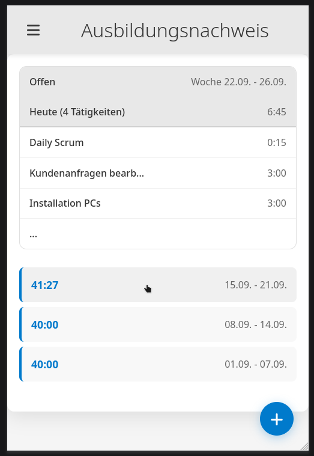
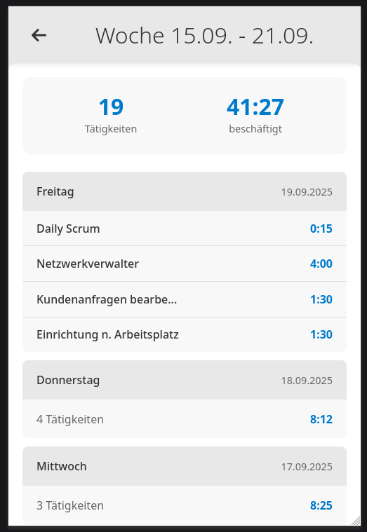

# Mobile Ansicht
Der User klickt eine Woche an, hier sichtbar anhand des Handsymbols, der Hintergrund wird beim Hover verdunkelt.

Der Benutzer klickt einen Tag an und kann die gespeicherten Tätigkeiten inspizieren

# Desktop Ansicht